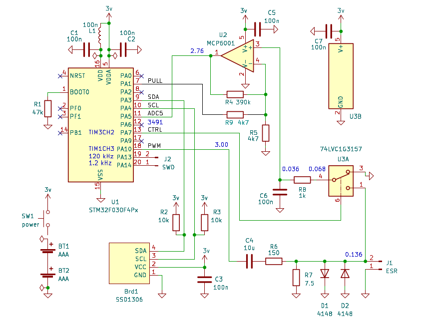
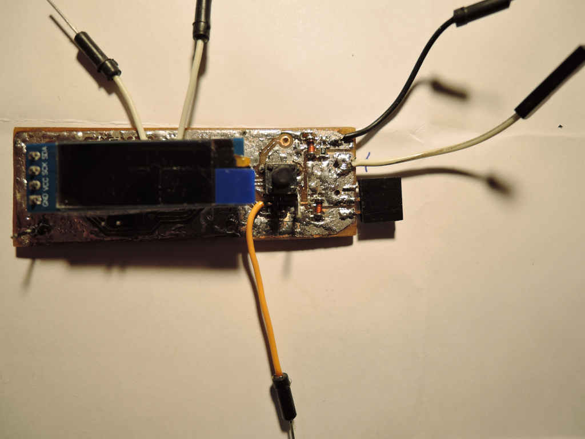

# In Circuit ESR Tester
batteries 2xAAA 
uc stm32f030f4p6 (cmsis) 
opamp mcp6001 
switch sn74lvc1g3157dvbr 
oled ssd1306 (128x32) 
sch and pcb (kicad) 

Управляемый делитель операционника для тех, 
кто решит экспериментировать с измерением 
ёмкости (адаптируя частототу шимов под esr) 
Пробная директива сдвига на pi/2 между сигналами 
(без адаптации) в главном заголовочном файле  
