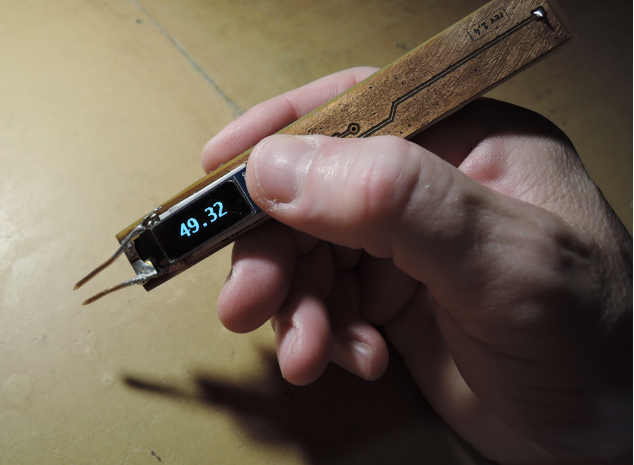

# In Circuit ESR Tester
What you have 
batteries 2xAAA 
uc stm32f030f4p6 (baremetal sources) 
opa mcp6001 
switch sn74lvc1g3157dvbr 
oled ssd1306 (128x32) 
schematics and pcb sources (kicad) 
some more smt components, skills, wishes.. 
What you get 
in-circuit capacitors esr tester  

